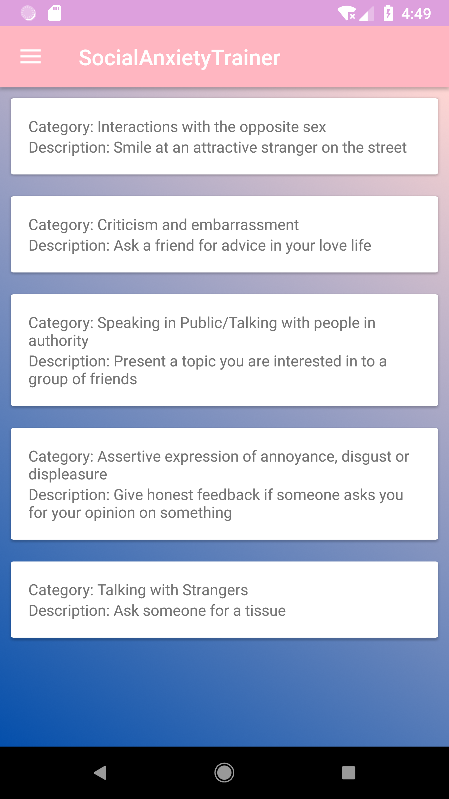

# Social Anxiety Trainer 
The 'Social Anxiety Trainer' is an Android application created in the context of the seminar ['How to build a social computer?'](http://affective.dfki.de/how-to-build-a-social-computer-ws2018/) at the DFKI (Deutsches Forschungszentrum für Künstliche Intelligenz).

The app is supposed to help people with low to medium social anxiety by performing regurlary tasks. It classifies the users individual anxiety level first on the basis of a questionnaire. The tasks the user has to solve belong to five categories which are congruent with the anxiety categories in the questionnaire. The user will level up and down depending on the users performance.

# Usage
The app can be used with out without supervision, but could be also used as a tool for therapists. The application relies on the honesty of the user.

# Monitoring
The performance of the tasks is monitored by the heart beat. After each finished task the user is asked to assess her own performance in a 0 to 10 scale. Note: We discarded the idea of monitoring the voice, due to the bad results of emotional classification of voice data. The Social Anxiety Trainer will use the data to show the progress in graphs.

# Prerequisites
In order to utilize the heart beat monitoring, the user needs a Microsoft Band. Connect this device in the `Connect` menu.
